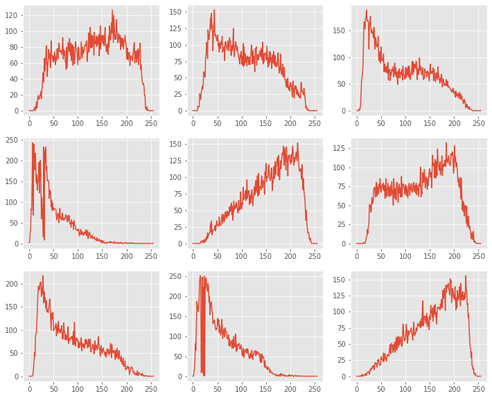
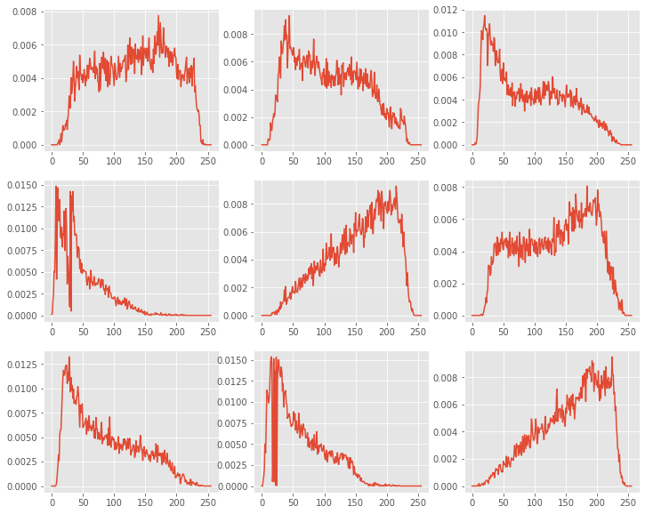

# Tópicos de Visão Computacional

## Trabalho 1 - Reconhecimento de imagens a partir de histogramas e PDF's.

O presente trabalho busca criar um reconhecedor de imagens do dataset [Vision Texture](https://vismod.media.mit.edu/vismod/imagery/VisionTexture/).

Na seção de hyper parâmetros é possível definir o número de imagens similares para comparação. Para este trabalho foram consideradas 3 imagens de comparação.

As funções de distância implementadas foram:

- Distância euclidiana.
- $\chi^2$.
- Correlação (não usada).
- Bhattacharyya.

Os canais comparados foram:

- Tons de cinza (média).
- Tons de cinza (brilho).
- Tons de cinza (luminosidade).
- RGB, canal vermelho.
- RGB, canal verde.
- RGB, canal azul.
- RGB, soma dos canais vermelho e azul.

Os histogramas e respectivas PDF's foram calculadas. Alguns exemplos de histograma e PDF's das amostras do dataset são mostradas abaixo.

A seção de avaliação de reconhecimento realiza uma avaliação de acerto para cada amostra do dataset. Os melhores resultados nortearam a seleção da pdf, função de distância e formato de imagem de entrada para o preditor.

Por fim a seção de resultados apresenta discussão sobre a porcentagem de acurácia nos resultados obtidos.
